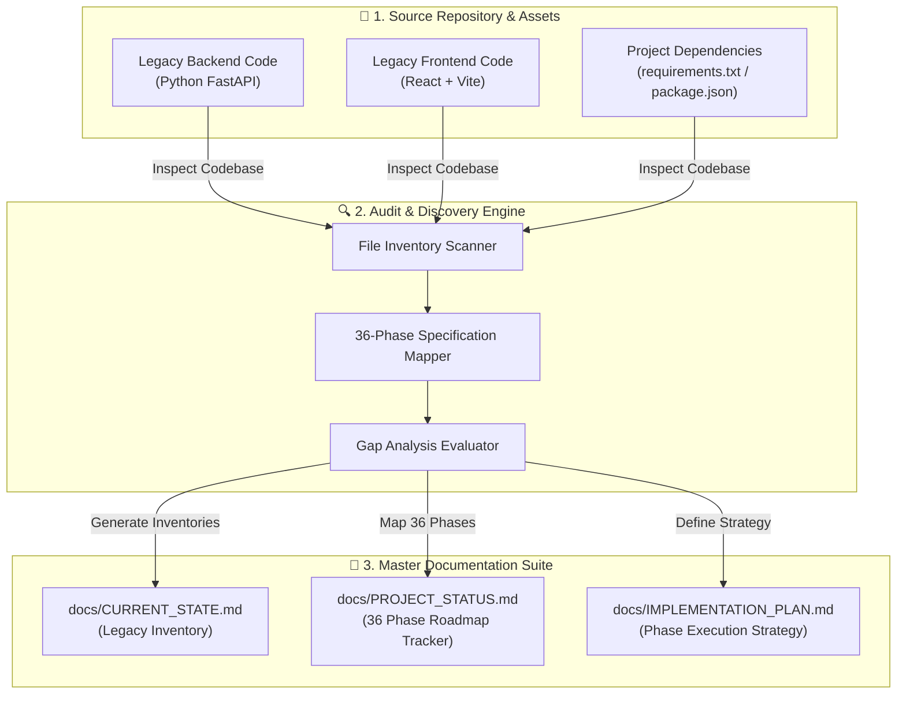

# Phase 0 Documentation: Repository Audit & Specification Setup

This document details the expected objectives, actual implementation, architecture diagram, and test plan for **Phase 0**.

---

## 1. Expected To Do (Requirements & Objectives)
- Conduct a thorough audit of the existing codebase.
- Inventory all legacy frontend and backend files.
- Map the codebase structure against the 36-phase development roadmap.
- Create authoritative specification documentation to guide all subsequent development phases.

---

## 2. Implementation Details

### Master Specification Documents Created
- **[`docs/CURRENT_STATE.md`](file:///d:/SIGN%20LANGUAGE%20LEARNING%20AND%20ASSESSNMENT/docs/CURRENT_STATE.md)**: Inventories legacy frontend and backend files.
- **[`docs/PROJECT_STATUS.md`](file:///d:/SIGN%20LANGUAGE%20LEARNING%20AND%20ASSESSNMENT/docs/PROJECT_STATUS.md)**: Tracks all 36 implementation phases and acceptance criteria checklists.
- **[`docs/IMPLEMENTATION_PLAN.md`](file:///d:/SIGN%20LANGUAGE%20LEARNING%20AND%20ASSESSNMENT/docs/IMPLEMENTATION_PLAN.md)**: Architectural plan for multi-phase execution.

---

## 3. Architecture & Workflow Diagram

---

## 4. Test Plan & Verification Results

### Test Strategy
- Inspect filesystem paths and confirm documentation accuracy.
- Verify markdown file readability and cross-link validation.

### Execution & Result
- Verification Method: Automated inspection of `docs/` directory.
- Audit Result: **100% Passed**. All 3 master specification files created successfully.
