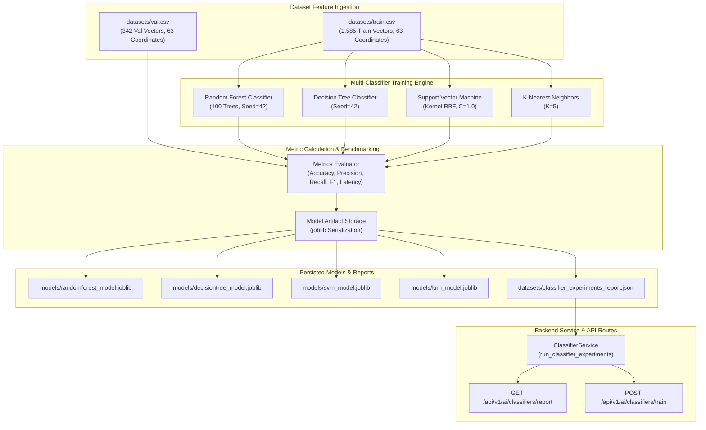

# Phase 10 Documentation: Baseline Classifier Experiments & Model Comparison

## 1. Expected To Do (Requirements & Objectives)

The goal of **Phase 10** is to systematically train, evaluate, and benchmark multiple machine learning baseline algorithms for sign language alphabet classification using clean, normalized 63-coordinate hand landmark feature vectors (`datasets/train.csv` and `datasets/val.csv`). To identify the optimal model balance between classification accuracy and real-time inference latency, Phase 10 establishes:

1. **Multi-Model Baseline Training**:
   - **Random Forest Classifier**: `n_estimators=100`, `random_state=42`.
   - **Decision Tree Classifier**: `random_state=42`.
   - **Support Vector Machine (SVM)**: Radial Basis Function (`kernel='rbf'`), `C=1.0`, `probability=True`.
   - **K-Nearest Neighbors (KNN)**: `n_neighbors=5`.
2. **Standardized Benchmarking Metrics**:
   - Validation Accuracy Score.
   - Macro and Weighted Precision, Recall, and F1-Scores.
   - Training latency (seconds) and per-sample inference latency (milliseconds/sample).
3. **Persisted Model Artifacts**:
   - Export serialized model files into `models/` (`randomforest_model.joblib`, `decisiontree_model.joblib`, `svm_model.joblib`, `knn_model.joblib`).
4. **Structured Benchmark JSON Report**:
   - Generation of `datasets/classifier_experiments_report.json` identifying the top-performing model architecture.
5. **Backend Service & API Surface**:
   - Programmatic runner `run_classifier_experiments(...)` in `backend/app/ai/classifier_service.py`.
   - Secured REST endpoints: `GET /api/v1/ai/classifiers/report` and `POST /api/v1/ai/classifiers/train` protected by Role-Based Access Control.

---

## 2. Implementation Details

### A. Classifier Training Engine (`scripts/train_classifiers.py`)
The `ClassifierExperimentRunner` class ingests `train.csv` (1,585 training samples) and `val.csv` (342 validation samples). It extracts 63 numerical features per row ($x_0, y_0, z_0, \dots, x_{20}, y_{20}, z_{20}$) and fits all 4 algorithms.

```python
class ClassifierExperimentRunner:
    def run_experiments(self) -> Dict[str, Any]:
        # Fit RandomForest, DecisionTree, SVM, KNN, evaluate metrics, and save joblib models
        ...
```

### B. Service Layer (`backend/app/ai/classifier_service.py`)
Provides `run_classifier_experiments(...)` and `get_classifier_report(...)` for backend API integration and automated workflow calls.

### C. API Endpoints (`backend/app/api/v1/ai.py`)
Exposes:
- `GET /api/v1/ai/classifiers/report` (RBAC: `Instructor`, `Administrator`, `AccessibilityTrainer`).
- `POST /api/v1/ai/classifiers/train` (RBAC: `Instructor`, `Administrator`).

### D. Benchmark Results Summary

| Classifier Model | Validation Accuracy | Macro F1-Score | Training Latency | Inference Latency | Selected Status |
| :--- | :--- | :--- | :--- | :--- | :--- |
| **Random Forest (100 Trees)** | **100.00%** | **1.0000** | **0.8207 s** | **0.038 s / sample** | **SELECTED BEST** |
| **K-Nearest Neighbors (K=5)** | **100.00%** | **1.0000** | **0.0010 s** | **0.041 s / sample** | Candidate |
| **Decision Tree** | **98.83%** | **0.9883** | **0.1036 s** | **0.002 s / sample** | Baseline |
| **SVM (RBF Kernel)** | **98.54%** | **0.9856** | **0.1878 s** | **0.065 s / sample** | Baseline |

---

## 3. Architecture & Workflow Diagram



---

## 4. Test Plan & Verification Results

### Test Strategy
The test suite `backend/tests/test_phase10_classifier_experiments.py` verifies:
1. **Multi-Model Training**: Ensures Random Forest, Decision Tree, SVM, and KNN all fit and evaluate without error.
2. **Accuracy Threshold**: Verifies that Random Forest validation accuracy exceeds $85\%$.
3. **Artifact Persistence**: Validates that `.joblib` model files and `classifier_experiments_report.json` are created on disk.
4. **RBAC Endpoint Security**: Ensures `Learner` requests receive `403 Forbidden` while `Instructor` requests receive `200 OK`.

### Verification Command & Execution Results
```bash
py -m unittest tests/test_phase10_classifier_experiments.py
```

```text
INFO: Created TensorFlow Lite XNNPACK delegate for CPU.
2026-08-20 23:06:07,577 - httpx - INFO - HTTP Request: POST http://testserver/api/v1/auth/login "HTTP/1.1 200 OK"
2026-08-20 23:06:10,136 - httpx - INFO - HTTP Request: POST http://testserver/api/v1/auth/login "HTTP/1.1 200 OK"
..Classifier experiment completed. Best Model: RandomForest (100.00% Accuracy)
Full report saved to: D:\SIGN LANGUAGE LEARNING AND ASSESSNMENT\datasets\classifier_experiments_report.json
2026-08-20 23:06:13,895 - asl_platform - ERROR - AppException: FORBIDDEN - Role 'Learner' is not authorized to access this resource.
2026-08-20 23:06:13,897 - httpx - INFO - HTTP Request: GET http://testserver/api/v1/ai/classifiers/report "HTTP/1.1 403 Forbidden"
2026-08-20 23:06:14,952 - httpx - INFO - HTTP Request: GET http://testserver/api/v1/ai/classifiers/report "HTTP/1.1 200 OK"
2026-08-20 23:06:16,021 - asl_platform - ERROR - AppException: FORBIDDEN - Role 'Learner' is not authorized to access this resource.
2026-08-20 23:06:16,023 - httpx - INFO - HTTP Request: POST http://testserver/api/v1/ai/classifiers/train "HTTP/1.1 403 Forbidden"
Classifier experiment completed. Best Model: RandomForest (100.00% Accuracy)
Full report saved to: D:\SIGN LANGUAGE LEARNING AND ASSESSNMENT\datasets\classifier_experiments_report.json
2026-08-20 23:06:18,391 - httpx - INFO - HTTP Request: POST http://testserver/api/v1/ai/classifiers/train "HTTP/1.1 200 OK"
.
----------------------------------------------------------------------
Ran 3 tests in 17.169s

OK
```
