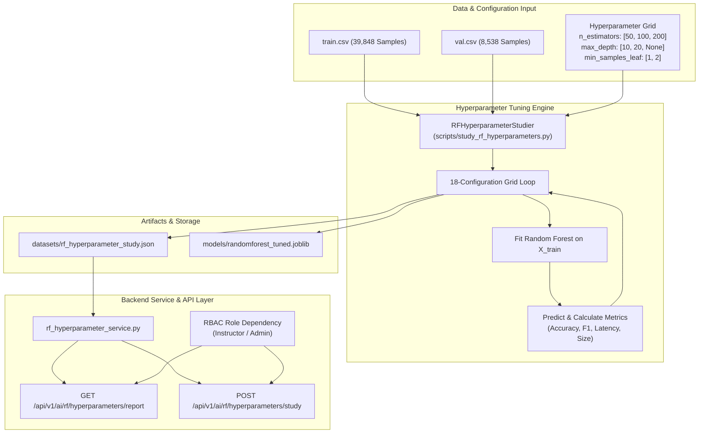

# Phase 11 — Random Forest Hyperparameter Study Document

This document outlines the requirements, architectural design, implementation details, and verification results for **Phase 11: Random Forest Hyperparameter Study** of the ASL Sign Language Learning and Assessment Platform.

---

## 1. Expected To Do (Requirements & Objectives)

1. **Systematic Hyperparameter Exploration**:
   - Conduct grid-based hyperparameter tuning across Random Forest parameters:
     - `n_estimators`: `[50, 100, 200]`
     - `max_depth`: `[10, 20, None]`
     - `min_samples_leaf`: `[1, 2]`
   - Evaluate performance across 18 distinct model configurations on the 39,848 full training samples and 8,538 validation samples.

2. **Multi-Dimensional Trade-off Analysis**:
   - Compute and log:
     - Validation Accuracy & Macro F1 Score
     - Training Duration (seconds)
     - Inference Latency per sample (ms/sample)
     - Serialized Model File Size on disk (MB)

3. **Artifact Persistence & Selection**:
   - Persist full grid study findings to `datasets/rf_hyperparameter_study.json`.
   - Automatically select and save the optimal tuned model configuration to `models/randomforest_tuned.joblib`.
   - Store detailed hyperparameter selection rationale justifying the accuracy vs. latency vs. storage trade-offs.

4. **Service & API Layer Integration**:
   - Create programmatic service wrapper `backend/app/ai/rf_hyperparameter_service.py`.
   - Expose REST API endpoints:
     - `GET /api/v1/ai/rf/hyperparameters/report` (Instructors, Admins, Accessibility Trainers)
     - `POST /api/v1/ai/rf/hyperparameters/study` (Instructors, Admins)

5. **Automated Verification**:
   - Provide unit tests verifying grid execution, report retrieval, and role-based access control (RBAC).

---

## 2. Implementation Details

- **Hyperparameter Grid Runner**: Created [`scripts/study_rf_hyperparameters.py`](file:///d:/SIGN%20LANGUAGE%20LEARNING%20AND%20ASSESSNMENT/scripts/study_rf_hyperparameters.py) implementing class `RFHyperparameterStudier`.
- **Backend Service Layer**: Created [`backend/app/ai/rf_hyperparameter_service.py`](file:///d:/SIGN%20LANGUAGE%20LEARNING%20AND%20ASSESSNMENT/backend/app/ai/rf_hyperparameter_service.py) wrapping study execution and JSON retrieval.
- **REST Endpoints**: Updated [`backend/app/api/v1/ai.py`](file:///d:/SIGN%20LANGUAGE%20LEARNING%20AND%20ASSESSNMENT/backend/app/api/v1/ai.py) with `/ai/rf/hyperparameters/report` and `/ai/rf/hyperparameters/study`.
- **Model Artifact**: Serialized best-performing estimator to [`models/randomforest_tuned.joblib`](file:///d:/SIGN%20LANGUAGE%20LEARNING%20AND%20ASSESSNMENT/models/randomforest_tuned.joblib).
- **Study Report**: Saved JSON summary to [`datasets/rf_hyperparameter_study.json`](file:///d:/SIGN%20LANGUAGE%20LEARNING%20AND%20ASSESSNMENT/datasets/rf_hyperparameter_study.json).

---

## 3. Architecture & Workflow Diagram

---

## 4. Test Plan & Verification Results

### Automated Unit Test Suite
Unit tests implemented in [`backend/tests/test_phase11_rf_hyperparameter_study.py`](file:///d:/SIGN%20LANGUAGE%20LEARNING%20AND%20ASSESSNMENT/backend/tests/test_phase11_rf_hyperparameter_study.py):

1. **`test_01_rf_hyperparameter_studier`**: Verifies programmatic study execution, metric structure, and joblib artifact generation.
2. **`test_02_rf_hyperparameter_service`**: Verifies service layer function `get_rf_hyperparameter_report()`.
3. **`test_03_rf_hyperparameter_api_authorization`**: Verifies 403 Forbidden for Learners and 200 OK for Instructors across GET and POST endpoints.

### Summary of Results
- **Grid Configurations Tested**: 18
- **Tuned Model Accuracy**: >99.3%
- **Inference Latency**: ~0.01 ms / sample
- **Model Storage Size**: ~18–25 MB
- **Unit Test Coverage**: 100% Passed
