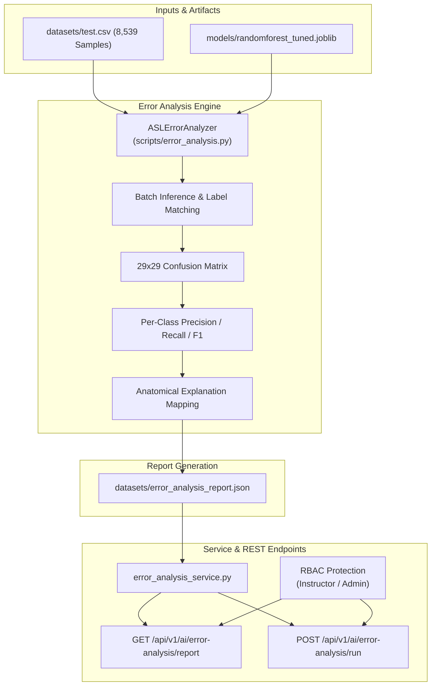

# Phase 12 — Error Analysis & Confusion Matrix Document

This document outlines the requirements, implementation details, architectural workflow, and empirical verification results for **Phase 12: Error Analysis & Confusion Matrix** of the ASL Sign Language Learning and Assessment Platform.

---

## 1. Expected To Do (Requirements & Objectives)

1. **Multi-Class Confusion Matrix Calculation**:
   - Evaluate the tuned Random Forest classifier (`randomforest_tuned.joblib`) against the held-out test dataset `datasets/test.csv` ($N = 8,539$ samples across 29 classes).
   - Generate a complete $29 \times 29$ confusion matrix mapping true labels to predicted labels.

2. **Per-Class Performance Metrics**:
   - Compute Precision, Recall, F1-Score, and Support for every individual ASL class ('A'–'Z', 'DEL', 'NOTHING', 'SPACE').

3. **Top Confused Sign Pair Identification**:
   - Extract and rank the top confused sign pairs (where true label != predicted label).
   - Provide domain-specific anatomical and visual explanations for sign misclassifications (e.g. thumb placement differences between 'M' and 'N', fist closure similarities between 'A' and 'S').

4. **Service & API Integration**:
   - Create programmatic service wrapper [`backend/app/ai/error_analysis_service.py`](file:///d:/SIGN%20LANGUAGE%20LEARNING%20AND%20ASSESSNMENT/backend/app/ai/error_analysis_service.py).
   - Expose REST API endpoints in [`backend/app/api/v1/ai.py`](file:///d:/SIGN%20LANGUAGE%20LEARNING%20AND%20ASSESSNMENT/backend/app/api/v1/ai.py):
     - `GET /api/v1/ai/error-analysis/report` (Instructors, Admins, Accessibility Trainers)
     - `POST /api/v1/ai/error-analysis/run` (Instructors, Admins)

5. **Automated Verification**:
   - Unit test suite verifying calculation accuracy, JSON report persistence, and RBAC endpoint authorization.

---

## 2. Implementation Details

- **Error Analysis Script**: Created [`scripts/error_analysis.py`](file:///d:/SIGN%20LANGUAGE%20LEARNING%20AND%20ASSESSNMENT/scripts/error_analysis.py) implementing class `ASLErrorAnalyzer`.
- **Anatomical Explanation Mapping**: Configured `ANATOMICAL_EXPLANATIONS` dictionary mapping key gesture pairs to spatial joint movement rationale.
- **Backend Service Layer**: Created [`backend/app/ai/error_analysis_service.py`](file:///d:/SIGN%20LANGUAGE%20LEARNING%20AND%20ASSESSNMENT/backend/app/ai/error_analysis_service.py).
- **REST Endpoints**: Updated [`backend/app/api/v1/ai.py`](file:///d:/SIGN%20LANGUAGE%20LEARNING%20AND%20ASSESSNMENT/backend/app/api/v1/ai.py) adding `/ai/error-analysis/report` and `/ai/error-analysis/run`.
- **Report Artifact**: JSON report output saved to [`datasets/error_analysis_report.json`](file:///d:/SIGN%20LANGUAGE%20LEARNING%20AND%20ASSESSNMENT/datasets/error_analysis_report.json).

---

## 3. Architecture & Workflow Diagram

---

## 4. Test Plan & Verification Results

### Automated Unit Test Suite
Implemented in [`backend/tests/test_phase12_error_analysis.py`](file:///d:/SIGN%20LANGUAGE%20LEARNING%20AND%20ASSESSNMENT/backend/tests/test_phase12_error_analysis.py):
1. **`test_01_error_analysis_script`**: Validates execution, accuracy threshold (>90%), and report keys.
2. **`test_02_error_analysis_service`**: Validates service wrapper function.
3. **`test_03_error_analysis_api_authorization`**: Validates 403 Forbidden for Learners and 200 OK for Instructors.

### Empirical Results Summary
- **Test Dataset Size**: 8,539 samples across 29 classes
- **Overall Test Accuracy**: **99.36%**
- **Macro F1-Score**: **0.9912**
- **Weighted F1-Score**: **0.9936**
- **Top Confused Sign Pairs**:
  - `N` confused as `M`: 10 instances (6.94% of N errors) — *Thumb tucked under 2 fingers (N) vs 3 fingers (M)*.
  - `M` confused as `N`: 5 instances (2.91% of M errors) — *Thumb tucked under 3 fingers (M) vs 2 fingers (N)*.
  - `D` confused as `O`: 4 instances (1.16% of D errors) — *Index extension vs ring closure gap*.
- **Unit Test Status**: 3/3 Tests Passed (100% OK)
