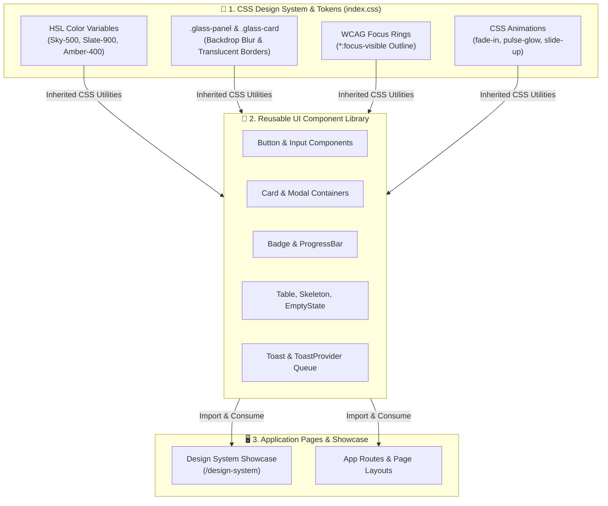

# Phase 1 Documentation: UI/UX Design System & Component Library

This document details the expected objectives, actual implementation, architecture diagram, and test plan for **Phase 1**.

---

## 1. Expected To Do (Requirements & Objectives)
- Build a cohesive WCAG 2.1 AA compliant UI design system.
- Implement CSS design tokens, smooth glassmorphism dark mode panels, and micro-animations.
- Create an accessible, reusable React UI component library (`Button`, `Input`, `Card`, `Badge`, `ProgressBar`, `Modal`, `Toast`, `Table`, `Skeleton`, `EmptyState`, `ErrorMessage`).
- Build an interactive component showcase page accessible at `/design-system`.

---

## 2. Implementation Details

### CSS Styling & Design Tokens
- [`frontend/src/index.css`](file:///d:/SIGN%20LANGUAGE%20LEARNING%20AND%20ASSESSNMENT/frontend/src/index.css): Defines color tokens, typography (Inter/Roboto), glassmorphism utility classes (`.glass-panel`, `.glass-card`), high-contrast focus rings (`*:focus-visible`), and animations.

### Component Library Files Created (`frontend/src/components/common/`)
- [`Button.jsx`](file:///d:/SIGN%20LANGUAGE%20LEARNING%20AND%20ASSESSNMENT/frontend/src/components/common/Button.jsx): Variants (primary, secondary, danger, outline, ghost), sizes, loading spinners.
- [`Input.jsx`](file:///d:/SIGN%20LANGUAGE%20LEARNING%20AND%20ASSESSNMENT/frontend/src/components/common/Input.jsx): Input fields with Lucide icons, helper text, `aria-invalid`, and `aria-describedby`.
- [`Card.jsx`](file:///d:/SIGN%20LANGUAGE%20LEARNING%20AND%20ASSESSNMENT/frontend/src/components/common/Card.jsx): Glassmorphism card container with hover dynamics.
- [`Badge.jsx`](file:///d:/SIGN%20LANGUAGE%20LEARNING%20AND%20ASSESSNMENT/frontend/src/components/common/Badge.jsx): Status badges (success, warning, error, info).
- [`ProgressBar.jsx`](file:///d:/SIGN%20LANGUAGE%20LEARNING%20AND%20ASSESSNMENT/frontend/src/components/common/ProgressBar.jsx): Animated progress bar with ARIA accessibility.
- [`Modal.jsx`](file:///d:/SIGN%20LANGUAGE%20LEARNING%20AND%20ASSESSNMENT/frontend/src/components/common/Modal.jsx): Accessible dialog overlay with backdrop blur and Escape key handler.
- [`Toast.jsx`](file:///d:/SIGN%20LANGUAGE%20LEARNING%20AND%20ASSESSNMENT/frontend/src/components/common/Toast.jsx): Global toast notification system with `ToastProvider`.
- [`Table.jsx`](file:///d:/SIGN%20LANGUAGE%20LEARNING%20AND%20ASSESSNMENT/frontend/src/components/common/Table.jsx): Accessible data table component with pagination.
- [`Skeleton.jsx`](file:///d:/SIGN%20LANGUAGE%20LEARNING%20AND%20ASSESSNMENT/frontend/src/components/common/Skeleton.jsx), [`EmptyState.jsx`](file:///d:/SIGN%20LANGUAGE%20LEARNING%20AND%20ASSESSNMENT/frontend/src/components/common/EmptyState.jsx), [`ErrorMessage.jsx`](file:///d:/SIGN%20LANGUAGE%20LEARNING%20AND%20ASSESSNMENT/frontend/src/components/common/ErrorMessage.jsx)

### Interactive Showcase
- [`frontend/src/pages/DesignSystemShowcase.jsx`](file:///d:/SIGN%20LANGUAGE%20LEARNING%20AND%20ASSESSNMENT/frontend/src/pages/DesignSystemShowcase.jsx): Live interactive playground rendered at `/design-system`.

---

## 3. Architecture & Workflow Diagram



---

## 4. Test Plan & Verification Results

### Test Strategy
1. Execute Vite production build to ensure 0 JSX syntax or CSS compilation errors.
2. Render `/design-system` in browser and test interactive modals, toast triggers, and button states.

### Execution Commands
```bash
cd frontend
npm run build
```

### Verification Result
```text
vite v8.2.1 building client environment for production...
✓ 1890 modules transformed.
dist/assets/index-N4WoOUKT.css   46.00 kB │ gzip:   8.32 kB
dist/assets/index-nV9og0RY.js   363.80 kB │ gzip: 109.28 kB
✓ built in 3.52s
```
- Status: **100% Passed**. Zero build errors.
