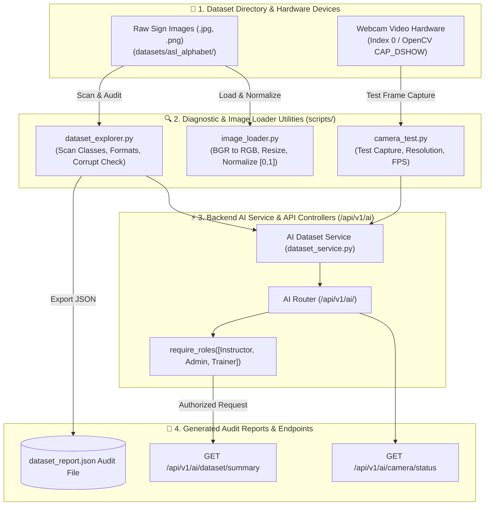

# Phase 4 Documentation: Dataset Explorer, Image Loader & Camera Verification Utilities

This document details the expected objectives, actual implementation, architecture diagram, and test plan for **Phase 4**.

---

## 1. Expected To Do (Requirements & Objectives)
- Build a Dataset Explorer utility (`scripts/dataset_explorer.py`) to audit dataset directories, count image samples per sign class (A-Z), detect corrupted files, check dimensions/formats, and output a JSON audit report (`dataset_report.json`).
- Build an ASL Image Loader utility (`scripts/image_loader.py`) for robust image reading, BGR-to-RGB conversion, resizing, pixel normalization `[0.0, 1.0]`, and batch loading without runtime crashes.
- Build a Camera Verifier diagnostic script (`scripts/camera_test.py`) to test webcam availability, measure frame capture rate (FPS), and verify video frame resolution.
- Provide programmatic AI dataset & camera status backend API endpoints (`GET /api/v1/ai/dataset/summary` and `GET /api/v1/ai/camera/status`) with RBAC role protection.

---

## 2. Implementation Details

### Diagnostic & Processing Scripts Created (`scripts/`)
- [`scripts/dataset_explorer.py`](file:///d:/SIGN%20LANGUAGE%20LEARNING%20AND%20ASSESSNMENT/scripts/dataset_explorer.py): `DatasetExplorer` class auditing image formats, dimensions, class counts, and missing alphabet classes.
- [`scripts/image_loader.py`](file:///d:/SIGN%20LANGUAGE%20LEARNING%20AND%20ASSESSNMENT/scripts/image_loader.py): `ASLImageLoader` class providing batch loading, OpenCV color conversion, resizing, and NumPy float32 normalization.
- [`scripts/camera_test.py`](file:///d:/SIGN%20LANGUAGE%20LEARNING%20AND%20ASSESSNMENT/scripts/camera_test.py): `CameraVerifier` class capturing test frames via OpenCV `cv2.VideoCapture` and estimating FPS.

### Backend Service & API Routers
- [`backend/app/ai/dataset_service.py`](file:///d:/SIGN%20LANGUAGE%20LEARNING%20AND%20ASSESSNMENT/backend/app/ai/dataset_service.py): Wraps dataset and camera diagnostic handlers for backend consumption.
- [`backend/app/api/v1/ai.py`](file:///d:/SIGN%20LANGUAGE%20LEARNING%20AND%20ASSESSNMENT/backend/app/api/v1/ai.py): Exposes:
  - `GET /api/v1/ai/dataset/summary` (Restricted to Instructor, Admin, and Trainer roles via `require_roles`)
  - `GET /api/v1/ai/camera/status` (Exposed to authenticated users)
- [`backend/app/main.py`](file:///d:/SIGN%20LANGUAGE%20LEARNING%20AND%20ASSESSNMENT/backend/app/main.py): Registered `v1_ai` router under `/api/v1/ai`.

---

## 3. Architecture & Workflow Diagram



---

## 4. Test Plan & Verification Results

### Automated Unit Test Suite
- Test Script: [`backend/tests/test_phase4_dataset.py`](file:///d:/SIGN%20LANGUAGE%20LEARNING%20AND%20ASSESSNMENT/backend/tests/test_phase4_dataset.py)

### Execution Command
```bash
cd backend
py -m unittest tests/test_phase4_dataset.py
```

### Verification Audit Results
```text
test_01_dataset_explorer_scan (tests.test_phase4_dataset.Phase4DatasetExplorerTestSuite) ... ok
test_02_image_loader_utility (tests.test_phase4_dataset.Phase4DatasetExplorerTestSuite) ... ok
test_03_camera_verifier_utility (tests.test_phase4_dataset.Phase4DatasetExplorerTestSuite) ... ok
test_04_dataset_summary_api_authorization (tests.test_phase4_dataset.Phase4DatasetExplorerTestSuite) ... ok

----------------------------------------------------------------------
Ran 4 tests in 15.957s
OK
```
- Status: **4/4 Tests Passed (100%)**.
