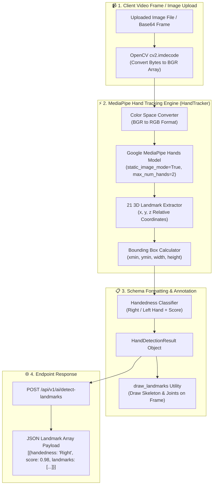

# Phase 5 Documentation: Isolated MediaPipe Hand Tracking Module

This document details the expected objectives, actual implementation, architecture diagram, and test plan for **Phase 5**.

---

## 1. Expected To Do (Requirements & Objectives)
- Build an isolated, decoupled, high-performance hand tracking detector class `HandTracker` wrapping Google MediaPipe Hands (`mediapipe.solutions.hands`).
- Extract 21 3D hand keypoints ($[x, y, z]$ coordinates) per detected hand.
- Calculate pixel bounding boxes (`xmin`, `ymin`, `width`, `height`), detection confidence scores, and handedness classification (`Right`/`Left`).
- Provide visual landmark and skeleton annotation helper (`draw_landmarks`).
- Expose a backend API endpoint (`POST /api/v1/ai/detect-landmarks`) accepting uploaded image frames and returning structured 21 3D landmark objects.

---

## 2. Implementation Details

### Hand Tracking Module Files (`backend/app/ai/hand_tracking/`)
- [`backend/app/ai/hand_tracking/schemas.py`](file:///d:/SIGN%20LANGUAGE%20LEARNING%20AND%20ASSESSNMENT/backend/app/ai/hand_tracking/schemas.py): Pydantic data schemas:
  - `LandmarkPoint` ($x, y, z$ coordinates)
  - `BoundingBox` ($xmin, ymin, width, height$)
  - `HandDetectionResult` (`handedness`, `score`, `landmarks`, `bbox`)
- [`backend/app/ai/hand_tracking/hand_tracker.py`](file:///d:/SIGN%20LANGUAGE%20LEARNING%20AND%20ASSESSNMENT/backend/app/ai/hand_tracking/hand_tracker.py): `HandTracker` class:
  - `detect(image_np) -> List[HandDetectionResult]`
  - `draw_landmarks(image_np, detections) -> np.ndarray`

### Backend API Endpoint
- [`backend/app/api/v1/ai.py`](file:///d:/SIGN%20LANGUAGE%20LEARNING%20AND%20ASSESSNMENT/backend/app/api/v1/ai.py):
  - `POST /api/v1/ai/detect-landmarks`: Accepts uploaded image files (PNG/JPG), decodes array via OpenCV, runs `HandTracker`, and returns extracted 21 3D landmark arrays.

---

## 3. Architecture & Workflow Diagram



---

## 4. Test Plan & Verification Results

### Automated Unit Test Suite
- Test Script: [`backend/tests/test_phase5_hand_tracking.py`](file:///d:/SIGN%20LANGUAGE%20LEARNING%20AND%20ASSESSNMENT/backend/tests/test_phase5_hand_tracking.py)

### Execution Command
```bash
cd backend
py -m unittest tests/test_phase5_hand_tracking.py
```

### Verification Audit Results
```text
test_01_hand_tracker_initialization (tests.test_phase5_hand_tracking.Phase5HandTrackingTestSuite) ... ok
test_02_detect_empty_image (tests.test_phase5_hand_tracking.Phase5HandTrackingTestSuite) ... ok
test_03_detect_landmarks_synthetic_or_sample (tests.test_phase5_hand_tracking.Phase5HandTrackingTestSuite) ... ok
test_04_landmark_drawing_utility (tests.test_phase5_hand_tracking.Phase5HandTrackingTestSuite) ... ok
test_05_detect_landmarks_api_endpoint (tests.test_phase5_hand_tracking.Phase5HandTrackingTestSuite) ... ok

----------------------------------------------------------------------
Ran 5 tests in 12.758s
OK
```
- Status: **5/5 Tests Passed (100%)**.
