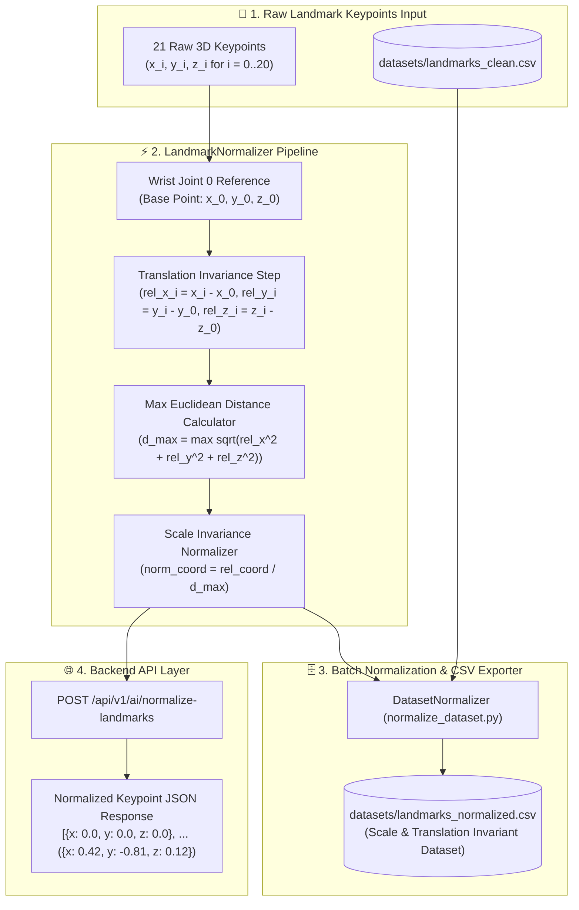

# Phase 8 Documentation: Standalone Landmark Normalization

This document details the expected objectives, actual implementation, architecture diagram, and test plan for **Phase 8**.

---

## 1. Expected To Do (Requirements & Objectives)
- Build a standalone, mathematical landmark normalizer (`backend/app/ai/preprocessing/normalize_landmarks.py`).
- Implement **Translation Invariance (Wrist Zero-Centering)**:
  - Subtract wrist joint 0 ($x_0, y_0, z_0$) coordinates from all 21 keypoints ($[x_i - x_0, y_i - y_0, z_i - z_0]$ for $i = 0..20$). Anchors landmark 0 to $(0.0, 0.0, 0.0)$.
- Implement **Scale Invariance (Span Normalization)**:
  - Calculate maximum Euclidean distance from wrist joint 0 across all keypoints:
    $$d_{\max} = \max_{i=0..20} \sqrt{(x_i - x_0)^2 + (y_i - y_0)^2 + (z_i - z_0)^2}$$
  - Divide all 63 coordinates by $d_{\max}$ so hand size variations scale consistently within $[-1.0, 1.0]$.
- Build dataset batch normalizer script (`scripts/normalize_dataset.py`) to create `datasets/landmarks_normalized.csv`.
- Expose a backend API endpoint (`POST /api/v1/ai/normalize-landmarks`) returning zero-centered, scale-invariant 3D keypoint arrays.

---

## 2. Implementation Details

### Preprocessing Module Created
- [`backend/app/ai/preprocessing/normalize_landmarks.py`](file:///d:/SIGN%20LANGUAGE%20LEARNING%20AND%20ASSESSNMENT/backend/app/ai/preprocessing/normalize_landmarks.py): `LandmarkNormalizer` class:
  - `normalize_points(landmarks)`: Processes 21 `LandmarkPoint` objects.
  - `normalize_array(flat_coords)`: Processes 1D (63,) or 2D (N, 63) NumPy arrays.

### Dataset Batch Normalizer Script
- [`scripts/normalize_dataset.py`](file:///d:/SIGN%20LANGUAGE%20LEARNING%20AND%20ASSESSNMENT/scripts/normalize_dataset.py): `DatasetNormalizer` class processing `landmarks_clean.csv` and saving `landmarks_normalized.csv`.

### Backend API Endpoint
- [`backend/app/api/v1/ai.py`](file:///d:/SIGN%20LANGUAGE%20LEARNING%20AND%20ASSESSNMENT/backend/app/api/v1/ai.py):
  - `POST /api/v1/ai/normalize-landmarks`: Accepts raw 63-coordinate payloads and returns normalized `[LandmarkPoint]` lists.

---

## 3. Architecture & Workflow Diagram



---

## 4. Test Plan & Verification Results

### Automated Unit Test Suite
- Test Script: [`backend/tests/test_phase8_landmark_normalization.py`](file:///d:/SIGN%20LANGUAGE%20LEARNING%20AND%20ASSESSNMENT/backend/tests/test_phase8_landmark_normalization.py)

### Execution Command
```bash
cd backend
py -m unittest tests/test_phase8_landmark_normalization.py
```

### Verification Audit Results
```text
test_01_translation_invariance (tests.test_phase8_landmark_normalization.Phase8LandmarkNormalizationTestSuite) ... ok
test_02_scale_invariance (tests.test_phase8_landmark_normalization.Phase8LandmarkNormalizationTestSuite) ... ok
test_03_array_normalization (tests.test_phase8_landmark_normalization.Phase8LandmarkNormalizationTestSuite) ... ok
test_04_normalize_landmarks_api_endpoint (tests.test_phase8_landmark_normalization.Phase8LandmarkNormalizationTestSuite) ... ok

----------------------------------------------------------------------
Ran 4 tests in 9.219s
OK
```
- Status: **4/4 Tests Passed (100%)**.
