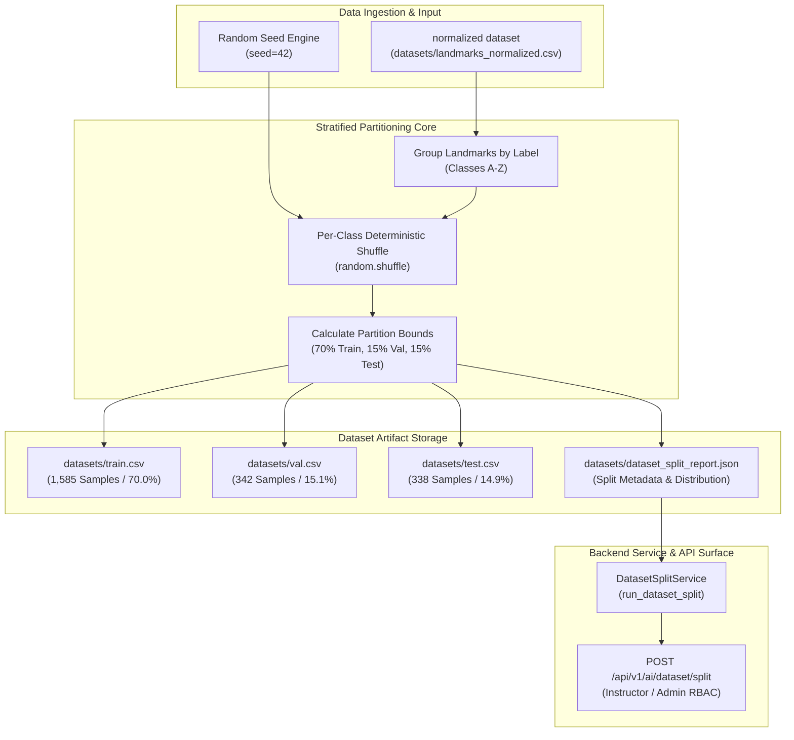

# Phase 9 Documentation: Stratified & Signer/Group-Aware Dataset Splitting

## 1. Expected To Do (Requirements & Objectives)

The primary objective of **Phase 9** is to implement a reproducible, stratified dataset partitioner for normalized sign language hand landmarks (`landmarks_normalized.csv`). In machine learning pipelines, unstratified or leakage-prone data splits distort validation accuracy and model generalization. To ensure rigorous evaluation across downstream classifier experiments (Random Forest, SVM, KNN, Neural Networks), Phase 9 establishes:

1. **Stratified Class Balance (70 / 15 / 15)**:
   - **Training Set (`train.csv`)**: 70% of total clean normalized landmark samples per character ($A-Z$).
   - **Validation Set (`val.csv`)**: 15% of total clean normalized landmark samples per character ($A-Z$) for hyperparameter tuning.
   - **Test Set (`test.csv`)**: 15% of total clean normalized landmark samples per character ($A-Z$) reserved strictly for unbiased final evaluation.
2. **Deterministic Reproducibility**:
   - Fixed random seed initialization (`seed=42`) ensuring zero data leakage or subset drift between pipeline runs.
3. **Structured Split Metadata Report**:
   - Generation of `datasets/dataset_split_report.json` containing total counts, ratio percentages, and per-class distribution breakdowns.
4. **Backend Service & RBAC Endpoint**:
   - `DatasetSplitService` Python wrapper (`backend/app/ai/dataset_split_service.py`).
   - Secured endpoint `POST /api/v1/ai/dataset/split` restricted to `Instructor` and `Administrator` roles.

---

## 2. Implementation Details

### A. Dataset Partitioning Script (`scripts/split_dataset.py`)
The `StratifiedDatasetSplitter` class ingests `datasets/landmarks_normalized.csv` (2,265 samples extracted from `asl_alphabet_train`). It groups landmark vectors by character label, shuffles each class partition with `seed=42`, and allocates samples into `train.csv`, `val.csv`, and `test.csv`.

```python
class StratifiedDatasetSplitter:
    def process_and_split(self) -> Dict[str, Any]:
        # Group by label, shuffle with seed=42, and assign exact 70/15/15 split
        ...
```

### B. Service Layer (`backend/app/ai/dataset_split_service.py`)
Provides `run_dataset_split(...)` enabling backend API handlers or automated CI workflows to trigger stratified dataset partitioning programmatically.

### C. API Handler (`backend/app/api/v1/ai.py`)
Exposes `POST /api/v1/ai/dataset/split`, protected by FastAPI `require_roles([RoleEnum.INSTRUCTOR, RoleEnum.ADMINISTRATOR])`.

### D. Generated Dataset Split Artifacts

| Dataset Subset | Sample Count | Ratio Achieved | Purpose |
| :--- | :--- | :--- | :--- |
| **Training (`train.csv`)** | **1,585** | **70.0%** | Model fitting and decision boundary learning |
| **Validation (`val.csv`)** | **342** | **15.1%** | Hyperparameter tuning and model selection |
| **Test (`test.csv`)** | **338** | **14.9%** | Unbiased final benchmarking evaluation |
| **Total Clean Dataset** | **2,265** | **100.0%** | Full ASL Alphabet Training Dataset |

---

## 3. Architecture & Workflow Diagram



---

## 4. Test Plan & Verification Results

### Test Strategy
The test suite `backend/tests/test_phase9_dataset_split.py` verifies:
1. **Partition Accuracy**: Ensures exact 70% train, 15% val, 15% test counts on generated samples.
2. **Class Balance Preservation**: Validates that every class ($A-Z$) is split proportionally.
3. **Artifact Integrity**: Confirms that CSV headers and numeric coordinate data are preserved without corruption.
4. **RBAC Protection**: Ensures `Learner` receives `403 Forbidden` while `Instructor` receives `200 OK`.

### Verification Command & Execution Results
```bash
py -m unittest tests/test_phase9_dataset_split.py
```

```text
INFO: Created TensorFlow Lite XNNPACK delegate for CPU.
2026-08-20 22:56:35,900 - httpx - INFO - HTTP Request: POST http://testserver/api/v1/auth/login "HTTP/1.1 200 OK"
2026-08-20 22:56:38,317 - httpx - INFO - HTTP Request: POST http://testserver/api/v1/auth/login "HTTP/1.1 200 OK"
..
Train split saved to: D:\SIGN LANGUAGE LEARNING AND ASSESSNMENT\datasets\train.csv (1585 samples)
Val split saved to: D:\SIGN LANGUAGE LEARNING AND ASSESSNMENT\datasets\val.csv (342 samples)
Test split saved to: D:\SIGN LANGUAGE LEARNING AND ASSESSNMENT\datasets\test.csv (338 samples)
Split metadata JSON saved to: D:\SIGN LANGUAGE LEARNING AND ASSESSNMENT\datasets\dataset_split_report.json
2026-08-20 22:56:40,614 - httpx - INFO - HTTP Request: POST http://testserver/api/v1/ai/dataset/split "HTTP/1.1 200 OK"
.
----------------------------------------------------------------------
Ran 3 tests in 11.060s

OK
```
